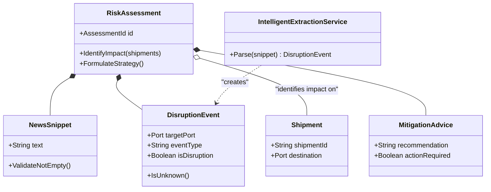

# Logical Architecture: Supply Chain Risk Context

## Section 1: Bounded Context Definition
*   **Context Name:** `SupplyChainRiskContext`
*   **Description:** A specialized context for analyzing unstructured data (news) to identify supply chain disruptions and correlate them with active shipments to provide actionable mitigation advice.
*   **Ubiquitous Language:**
    *   **News Snippet:** Raw, unstructured text input describing a potential event.
    *   **Disruption Event:** A structured representation of a risk extracted from news (Port, Type, Severity).
    *   **Risk Assessment:** The aggregate result of analyzing a snippet, including the event, affected shipments, and advice.
    *   **Affected Shipment:** A shipment identified as being at risk due to a disruption at its destination.
    *   **Mitigation Advice:** A generated recommendation for resolving or mitigating a specific disruption.

## Section 2: Domain Model Breakdown

### 2.1 Aggregates & Entities

#### Aggregate: Risk Assessment
*   **Aggregate Name:** `RiskAssessmentAggregate`
*   **Root Entity:** `RiskAssessment`
*   **Attributes:**
    *   `AssessmentId` (Identity)
    *   `SourceSnippet` (NewsSnippet Value Object)
    *   `DetectedEvent` (DisruptionEvent Value Object)
    *   `ImpactedShipments` (List of ShipmentEntity)
    *   `Strategy` (MitigationAdvice Value Object)
*   **Behaviors (Methods):**
    *   `IdentifyImpact(activeShipments: List<Shipment>) -> Implements [BR-005]: "Filter the provided list of active shipments to retain only those destined for the Port identified in the DetectedEvent."`
    *   `FormulateStrategy() -> Implements [BR-006, BR-007]: "If DetectedEvent is disruptive, generate specific advice; otherwise, set advice to 'No action required'."`
*   **Invariants:**
    *   `RiskAssessment` must always contain a valid `NewsSnippet`.
    *   `ImpactedShipments` cannot be determined if `DetectedEvent` is null or Unknown.

#### Entity: Shipment (External Reference)
*   **Aggregate Name:** `ShipmentAggregate` (Simplified for this context)
*   **Root Entity:** `Shipment`
*   **Attributes:**
    *   `ShipmentId` (Identity)
    *   `DestinationPort` (Port Value Object)
    *   `GoodsDescription` (String)
*   **Behaviors:**
    *   *Read-only in this context.*

### 2.2 Value Objects

#### Value Object: NewsSnippet
*   **Name:** `NewsSnippet`
*   **Behaviors:**
    *   `ValidateNotEmpty() -> Implements [BR-001]: "The input text must not be empty or null to initiate analysis."`

#### Value Object: DisruptionEvent
*   **Name:** `DisruptionEvent`
*   **Attributes:** `TargetPort`, `EventType`, `IsDisruption`
*   **Behaviors:**
    *   `IsUnknown() -> Implements [BR-003]: "Returns true if the TargetPort could not be identified from the source text."`

#### Value Object: MitigationAdvice
*   **Name:** `MitigationAdvice`
*   **Attributes:** `RecommendationText`, `ActionRequired` (Boolean)

### 2.3 Domain Services

#### Service: IntelligentExtractionService
*   **Service Name:** `IntelligentExtractionService`
*   **Responsibility:** Interfacing with AI/NLP capabilities to parse unstructured text into structured Domain Objects.
*   **Mapped Rules:**
    *   `Parse(NewsSnippet) -> Implements [BR-002]: "Extract Port Name, Event Type, and Severity from unstructured text."`
    *   `Parse(NewsSnippet) -> Implements [BR-004]: "If the text describes an event with no supply chain impact, flag IsDisruption as false."`

## Section 3: Traceability Matrix

| Legacy Rule ID | New Domain Location (Class.Method) | Logic Summary |
| :--- | :--- | :--- |
| `BR-001` | `NewsSnippet.ValidateNotEmpty()` | Input validation for empty text. |
| `BR-002` | `IntelligentExtractionService.Parse()` | Extract structured data (Port, Type) from text. |
| `BR-003` | `DisruptionEvent.IsUnknown()` | Handle cases where no location is found. |
| `BR-004` | `IntelligentExtractionService.Parse()` | Determine non-disruptive events. |
| `BR-005` | `RiskAssessment.IdentifyImpact()` | Match shipments to the disrupted port. |
| `BR-006` | `RiskAssessment.FormulateStrategy()` | Generate advice for disruptive events. |
| `BR-007` | `RiskAssessment.FormulateStrategy()` | Set "No action" for non-disruptive events. |

## Section 4: Visual Architecture (Mermaid)

