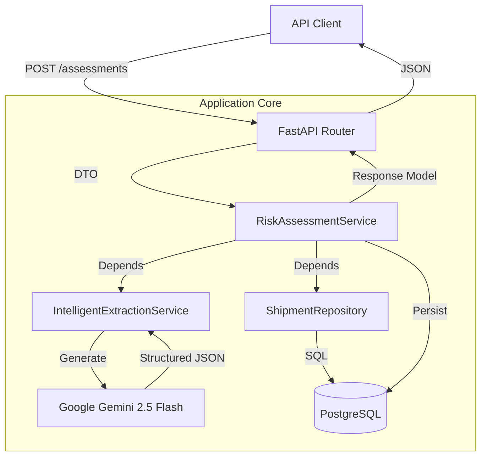

# Physical Architecture Specification: Supply Chain Risk System

## 1. Executive Summary

*   **System Name:** `SupplyChainRiskMonolith`
*   **Architecture:** Async Modular Monolith (FastAPI + Python 3.12 + Services).
*   **Persistence:** PostgreSQL (SQLAlchemy 2.0 Async) with Alembic Migrations.
*   **AI Engine:** Google Vertex AI (`gemini-2.5-flash`) via `google-genai` and `google-adk`.
*   **Core Philosophy:** "Ship Fast, Type Strict". The system utilizes strict Pydantic V2 validation for all I/O and SQLAlchemy 2.0 for type-safe database interactions.

## 2. Solution Layout

```text
src/
├── app/
│   ├── api/
│   │   └── v1/
│   │       ├── __init__.py
│   │       └── endpoints/
│   │           ├── assessment.py  # Risk Assessment Endpoints
│   │           └── shipment.py    # Shipment Reference Endpoints
│   ├── core/
│   │   ├── config.py              # Pydantic Settings
│   │   └── security.py
│   ├── db/
│   │   ├── base.py                # Declarative Base
│   │   └── session.py             # Async Session Factory
│   ├── models/                    # SQLAlchemy Tables
│   │   ├── __init__.py
│   │   ├── assessment.py
│   │   └── shipment.py
│   ├── schemas/                   # Pydantic DTOs
│   │   ├── assessment.py
│   │   ├── common.py
│   │   └── shipment.py
│   ├── services/                  # Business Logic Orchestration
│   │   ├── extraction_service.py  # Interfaces with GenAI Agents
│   │   └── risk_service.py        # Core Domain Logic
│   └── agents/                    # google-adk GenAI Agents
│       ├── prompts.py
│       └── risk_agent.py
├── alembic/                       # Database Migrations
├── tests/
├── Dockerfile
├── requirements.txt
└── main.py
```

## 3. Domain Schemas (Pydantic V2)

These schemas define the data contracts and strictly typed value objects used throughout the system.

```python
from pydantic import BaseModel, ConfigDict, Field
from typing import List, Optional
from uuid import UUID
from datetime import datetime

class DisruptionEvent(BaseModel):
    """Value Object representing the AI-extracted event."""
    model_config = ConfigDict(strict=True, frozen=True)

    target_port: Optional[str] = Field(
        None, description="The port identified in the text. None if unknown."
    )
    event_type: str = Field(..., description="Type of event (e.g., 'Strike', 'Weather').")
    is_disruption: bool = Field(..., description="True if the event negatively impacts operations.")
    confidence_score: float = Field(..., ge=0.0, le=1.0)

    def is_unknown(self) -> bool:
        return self.target_port is None

class MitigationAdvice(BaseModel):
    """Value Object for generated advice."""
    model_config = ConfigDict(strict=True, frozen=True)

    recommendation_text: str
    action_required: bool

class ShipmentSchema(BaseModel):
    """DTO for Shipment Entity."""
    model_config = ConfigDict(from_attributes=True)

    id: str
    destination_port: str
    goods_description: str

class RiskAssessmentRequest(BaseModel):
    """Input payload for the API."""
    news_text: str = Field(..., min_length=10, description="Raw news snippet to analyze.")

class RiskAssessmentResponse(BaseModel):
    """Aggregate Response DTO."""
    model_config = ConfigDict(from_attributes=True)

    assessment_id: UUID
    created_at: datetime
    detected_event: DisruptionEvent
    affected_shipments: List[ShipmentSchema]
    mitigation_strategy: MitigationAdvice
```

## 4. Service Layer & API

The Service Layer contains the pure business logic, separated from HTTP concerns.

### 4.1. Intelligent Extraction Service (`src/services/extraction_service.py`)

Wrapper around `google-adk` / `google-genai` to handle the LLM interaction.

```python
from google_genai import types
from src.schemas.assessment import DisruptionEvent

class IntelligentExtractionService:
    def __init__(self, model_client):
        self.client = model_client

    async def parse_snippet(self, text: str) -> DisruptionEvent:
        """
        Uses Gemini 2.5 Flash to extract structured data from unstructured text.
        Enforces strict JSON schema output via Pydantic.
        """
        # Implementation detail: Use Pydantic schema for response_schema
        ...
```

### 4.2. Risk Assessment Service (`src/services/risk_service.py`)

Orchestrates the workflow: Extraction -> Database Lookup -> Logic -> Persistence.

```python
from fastapi import Depends
from sqlalchemy.ext.asyncio import AsyncSession
from src.db.session import get_db
from src.models.assessment import RiskAssessmentModel
from src.repositories.shipment_repo import ShipmentRepository
from src.services.extraction_service import IntelligentExtractionService

class RiskAssessmentService:
    def __init__(
        self, 
        db: AsyncSession, 
        extractor: IntelligentExtractionService,
        shipment_repo: ShipmentRepository
    ):
        self.db = db
        self.extractor = extractor
        self.shipment_repo = shipment_repo

    async def create_assessment(self, news_text: str) -> RiskAssessmentModel:
        # 1. Validation (BR-001)
        if not news_text.strip():
            raise ValueError("News text cannot be empty")

        # 2. Extract Event (BR-002, BR-003, BR-004)
        event: DisruptionEvent = await self.extractor.parse_snippet(news_text)

        # 3. Identify Impact (BR-005)
        affected_shipments = []
        if not event.is_unknown() and event.is_disruption:
            affected_shipments = await self.shipment_repo.get_by_destination(event.target_port)

        # 4. Formulate Strategy (BR-006, BR-007)
        strategy = self._generate_strategy(event, affected_shipments)

        # 5. Persist Aggregate
        assessment = RiskAssessmentModel(
            source_snippet=news_text,
            detected_event=event.model_dump(),
            mitigation_strategy=strategy.model_dump(),
            affected_shipment_ids=[s.id for s in affected_shipments]
        )
        self.db.add(assessment)
        await self.db.commit()
        await self.db.refresh(assessment)
        
        return assessment

    def _generate_strategy(self, event, shipments) -> MitigationAdvice:
        # Pure logic implementation
        ...
```

### 4.3. API Endpoint (`src/app/api/v1/endpoints/assessment.py`)

Pure routing layer. Validates input -> Calls Service -> Returns Response.

```python
from fastapi import APIRouter, Depends, status
from src.schemas.assessment import RiskAssessmentRequest, RiskAssessmentResponse
from src.services.risk_service import RiskAssessmentService
from src.app.deps import get_risk_service # Dependency Injection Factory

router = APIRouter()

@router.post("/", response_model=RiskAssessmentResponse, status_code=status.HTTP_201_CREATED)
async def analyze_risk(
    request: RiskAssessmentRequest,
    service: RiskAssessmentService = Depends(get_risk_service)
):
    """
    Analyzes a news snippet to identify supply chain risks and affected shipments.
    """
    return await service.create_assessment(request.news_text)
```

## 5. Data Persistence Strategy

We use SQLAlchemy 2.0 with `Mapped` types for strictly typed table definitions. JSONB is used for complex value objects to allow flexibility in the AI schema without requiring constant DDL migrations.

### 5.1. Risk Assessment Table

```python
from sqlalchemy.orm import Mapped, mapped_column
from sqlalchemy.dialects.postgresql import JSONB, UUID, TEXT, ARRAY
from datetime import datetime
import uuid
from typing import Any
from src.db.base import Base

class RiskAssessmentModel(Base):
    __tablename__ = "risk_assessments"

    assessment_id: Mapped[uuid.UUID] = mapped_column(
        UUID(as_uuid=True), primary_key=True, default=uuid.uuid4
    )
    created_at: Mapped[datetime] = mapped_column(default=datetime.utcnow)
    
    # Store the raw input
    source_snippet: Mapped[str] = mapped_column(TEXT, nullable=False)

    # Store Value Objects as JSONB for queryability + schema flexibility
    detected_event: Mapped[dict[str, Any]] = mapped_column(JSONB, nullable=False)
    mitigation_strategy: Mapped[dict[str, Any]] = mapped_column(JSONB, nullable=False)

    # Simple array reference for the "Has-Many" relationship to Shipments
    # (In a full normalized form, this might be a join table, but for this aggregate, 
    # storing IDs is sufficient for the snapshot).
    affected_shipment_ids: Mapped[list[str]] = mapped_column(ARRAY(TEXT), default=[])
```

### 5.2. Shipment Table

```python
class ShipmentModel(Base):
    __tablename__ = "shipments"

    id: Mapped[str] = mapped_column(TEXT, primary_key=True) # e.g., "SCH-9001"
    destination_port: Mapped[str] = mapped_column(TEXT, index=True, nullable=False)
    goods_description: Mapped[str] = mapped_column(TEXT, nullable=False)
```

## 6. Mermaid Component Diagram


